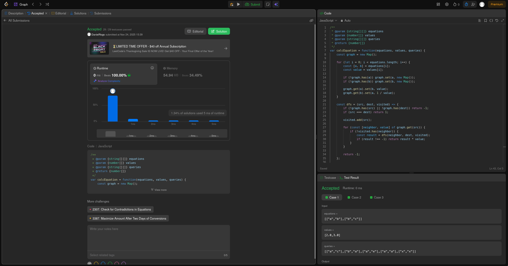
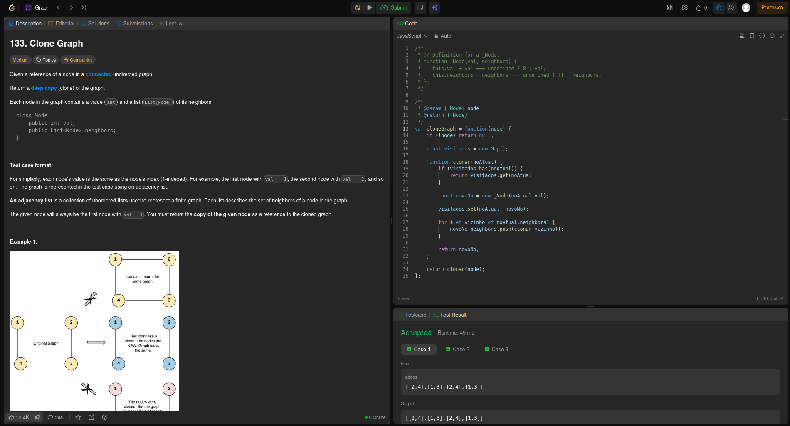

# Projeto: Grafo - LeetCode

## Alunos

| Matrícula  | Nome                      |
| ---------- | ------------------------- |
| 21/1061583 | Daniel Rodrigues da Rocha |
| 21/1061618 | Davi Rodrigues da Rocha   |

## Descrição do Projeto

Este projeto foi desenvolvido como parte da disciplina de **Estruturas de Dados e Algoritmos II (EDA2)**, com foco no estudo e implementação de grafos. O objetivo é demonstrar o domínio de técnicas fundamentais dos grafos através da resolução de problemas práticos da plataforma.

### Sobre o LeetCode

O [LeetCode](https://leetcode.com/) é uma plataforma online amplamente utilizada por programadores e estudantes de ciência da computação para praticar algoritmos e estruturas de dados. A plataforma oferece mais de 2.000 problemas categorizados por dificuldade (Fácil, Médio, Difícil) e por tópicos específicos como arrays, árvores, grafos, programação dinâmica, entre outros.

### Exercícios Selecionados

Para este projeto, foram selecionados **4 exercícios** que representam diferentes abordagens de algoritmos de busca, sendo 2 categorizados como **Médio** e 2 como **Difícil**.

| Exercício                                                                                                   | Dificuldade | Método de Busca |
| ----------------------------------------------------------------------------------------------------------- | ----------- | --------------- |
| [399. Evaluate Division](https://leetcode.com/problems/evaluate-division/description/?envType=problem-list-v2&envId=graph) | Médio       | Grafo           |
| []()       |             |                 |
| [133. Clone Graph](https://leetcode.com/problems/clone-graph/description/)  | Médio     | Grafo c/ DFS |
| [322. Reconstruct Itinerary](https://leetcode.com/problems/reconstruct-itinerary/description/)   | Difícil         | Grafo com DFS |

## Exercícios Desenvolvidos

### 399. Evaluate Division

O exercício 399. Evaluate Division é um problema de busca em grafos que exige a avaliação de divisões matemáticas através de equações conhecidas. A principal dificuldade deste problema está em modelar relações matemáticas como um grafo ponderado e encontrar caminhos que conectem variáveis para calcular divisões não diretamente fornecidas, utilizando propriedades transitivas das operações de divisão.

**Definição da Estrutura:**

O problema trabalha com:

- `equations`: Array de pares de variáveis representando divisões [A, B] onde A/B é conhecida
- `values`: Array de valores correspondentes às divisões (A/B = values[i])
- `queries`: Array de consultas [C, D] onde queremos encontrar C/D

**Entrada e Saída:**

- Entrada: Arrays de equações conhecidas, seus valores, e consultas a serem respondidas
- Saída: Array com os resultados das divisões solicitadas, ou -1.0 se indeterminado

**Solução Implementada:**

A solução utiliza **DFS (Depth-First Search)** com um grafo bidirecional representado por Map de Map para modelar as relações de divisão.

**Construção do Grafo:**
Para cada equação `a/b = valor`, o algoritmo cria duas arestas bidirecionais:

- De `a` para `b` com peso `valor` (a/b = valor)
- De `b` para `a` com peso `1/valor` (b/a = 1/valor)

```javascript
const graph = new Map();
graph.get(a).set(b, value); // a → b com peso value
graph.get(b).set(a, 1 / value); // b → a com peso 1/value
```

**Algoritmo DFS:**
A função interna `dfs(src, dest, visited)` implementa a busca em profundidade:

1. **Casos Base:** Verifica se as variáveis existem no grafo e se origem = destino (retorna 1.0)

2. **Controle de Ciclos:** Marca o nó atual como visitado para evitar loops infinitos

3. **Busca Recursiva:** Para cada vizinho não visitado:

   - Chama recursivamente `dfs(vizinho, destino, visited)`
   - Se encontrar um caminho válido, multiplica o resultado pelo peso da aresta atual
   - Retorna o produto acumulado dos pesos no caminho

4. **Cálculo do Resultado:** O valor final representa a multiplicação de todas as divisões no caminho encontrado, simulando a propriedade transitiva: se a/b = x e b/c = y, então a/c = x × y

**Processamento das Consultas:**
Para cada consulta [c, d], executa uma nova busca DFS com um conjunto fresh de nós visitados, garantindo independência entre as consultas.



### 133. Clone Graph

**Conceito:**

O exercício **133. Clone Graph** é um problema de manipulação de grafos que exige a criação de uma **cópia profunda (deep copy)** de um grafo não direcionado e conectado. A principal dificuldade deste problema está em garantir que todos os nós e suas conexões sejam duplicados de forma independente, mantendo a estrutura original do grafo, mas sem compartilhar referências de memória entre o grafo original e o clonado.

**Definição da Estrutura:**

Cada nó do grafo é representado por uma classe `Node` que contém:
- **val**: O valor inteiro do nó (que coincide com seu índice, 1-indexed)
- **neighbors**: Uma lista contendo referências para os nós vizinhos

```javascript
class Node {
    public int val;
    public List<Node> neighbors;
}
```

**Entrada e Saída:**

- **Entrada**: Uma referência para um nó em um grafo conectado não direcionado
- **Saída**: Uma referência para a cópia do nó dado, representando o grafo clonado completo

**Solução Implementada:**

A solução utiliza **DFS (Depth-First Search)** com recursão e um **HashMap** para rastrear nós já visitados,

Ele cria um `Map` (HashMap) para armazenar a correspondência entre nós originais e seus clones:
- **Chave**: Referência ao nó original
- **Valor**: Referência ao nó clonado

Logo em seguida, a função interna entra na lógica de DFS recursivo, o qual recebe o nó atual a ser clonado como parâmetro.

- Se o nó já foi clonado anteriormente, retorna o clone existente

Como próximo passo, é criado uma nova instância de `_Node` com o mesmo valor do nó original, e nesse momento, a lista de vizinhos ainda está vazia `[]`

Depois registramos o nó ANTES de processar seus vizinho para lidar com referências circulares.

Finaliznando, temos a iteração sobre todos os vizinhos do nó original:
- Para cada vizinho, chama recursivamente `clonar(vizinho)` e adiciona o vizinho clonado à lista de vizinhos do novo nó

Por fim, retorna a referência do nó clonado completo (com todos os vizinhos)

Temos então, um grafo completamente clonado com todas as conexões preservadas.



## Como Validar os Exercícios

Para verificar a corretude das implementações, siga estes passos:

### Passo 1: Acessar o LeetCode

1. Acesse [https://leetcode.com/](https://leetcode.com/)
2. Crie uma conta gratuita ou faça login

### Passo 2: Navegar para o Exercício

1. Digite o número do exercício na barra de busca (ex: "399")
2. Ou acesse diretamente pelos links fornecidos na tabela acima
3. Clique no exercício desejado

### Passo 3: Submeter o Código

1. Selecione **JavaScript** como linguagem no dropdown
2. Copie o código da função correspondente do arquivo `.js` do projeto
3. Cole o código no editor do LeetCode
4. Clique em **"Run"** para testar com os exemplos fornecidos
5. Clique em **"Submit"** para validação completa contra todos os casos de teste

## Referências
